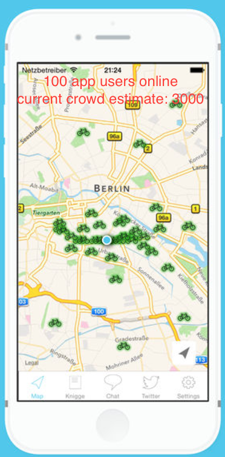

Estimation of crowd size at critical mass
================
Dirk Schumacher
9/17/2017

Introduction & Idea
-------------------

A longstanding open question of critical mass is: how many people participate in the ride? This document describes an idea on how to estimate the number of cyclist at the event using the popular app [critical maps](https://criticalmaps.net/).

The idea is the following: we do not know how many people enjoy the CM, but we know the exact number of people using the app *critical maps* to report their location at any given time. We could use that number and an estimate of how many of the total population use this app and estimate the total number of riders.

Let's assume, 100 people use the app at the start of the CM. We also know that 5% (95% CI 1.6% - 11.3%) of riders use the app. Then we can get an estimate of the total number by dividing 100 by 0.05 = 2000 (886 - 6085) people.

Plan
----

In order to get an estimate of the proportion of people using critical maps, we will do a quick survey among the participants right before the start of the CM. The questionnaire will have to questions:

-   Are you currently using the app critical maps? yes/no
-   How often did you attend the CM in the last year? 0 - 12

If we can get enough participants, we might be able to estimate the proportion.

In order to do this quickly, we need a lot of volunteers and an online data entry system, to capture the response. Ideally, someone who has worked on designing surveys could consult us beforehand.

Potential
---------

With that information, we could build an easy way to have a live estimate of CM participants. In particular, this works automatically without any manual intervention (like counting, filming or taking pictures).

Just a mockup to illustrate the idea. Image taken from the iOS app critical maps. It shows the current number of riders and a live estimate of the total mass.

Limitations
-----------

Of course, there are many flaws with this approach, but it is a first step. There can be biases in the surveyed people. The proportion of people using the app might fluctuate over the years (during the winter, the proportion might be higher).

Other methods
-------------

There are other methods possible:

-   Use a drone to do an aerial photo and count (automatically) the number of people.
-   Use traditional crowd estimation methods like counting at different positions and estimate the number of people.
-   Use a camera and computer vision to detect and count bike riders.
-   ...

Help
----

If you want to help and participate, please let me know. Do you have ideas on how to improve this idea? File an issue.
